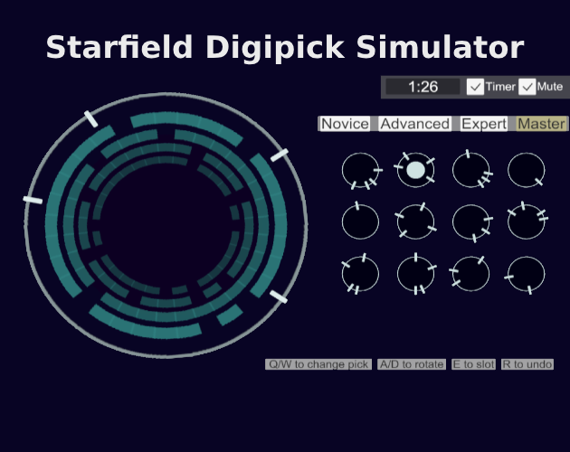

# Starfield Digipick-Locking Minigame Simulator

## Table of contents
1. [Link To Web Build](#linktowebbuild)
2. [Description](#description)
3. [Importing](#importing)
4. [Breakdown](#breakdown)
5. [Future Development](#future-development)
6. [Version Notes](#version-notes)
7. [News Articles](#news-articles)
8. [Visuals](#visuals)

## Link To Web Build
https://bb-dev.itch.io/starfield-digipick-simulator

## Description

This is a recreation of the lock-picking "digipick" minigame from Bethesda's Starfield. Bethesda games always have great lockpicking minigames for some reason and Starfield is no exception to that rule. This project is made with C# and Unity 2022.1.23f1, though it should work with most versions of Unity.

## Importing

To use this project in your own Unity project, download the "StarfieldDigipickSimUnityPackage.unitypackage" and import it into your project. The rest of the files in this repo are simply for reference, the unity package will import all of these files itself.

## Breakdown

As far as I can tell, the digipick in Starfield works something like this.
  1. The difficulty is selected. Novice and Advanced have only two rings (segments in my code), while expert has three and master has four.
  2. Two "picks" are generated for each ring/segment. This can vary from 1-4 possible pick points in each pick, depending on difficulty. These picks then "poke holes"/remove segments from their respective ring/segment. On harder difficulties, additional dud/fakeout picks are generated, which may accidentally be correct.
  3. The player changes picks/rotates picks, filling in empty holes in rings/segments until the puzzle is complete.

## Future Development

~~I didn't get around to putting audio in, I figure the audio is an important part of the Starfield version so I want to take the time necessary to add in the closest version to the original that I can.~~ Audio now in as of v.2 (but if you can get cleaner audio then let me know). ~~Also, this version is missing the feature from the main game where you can auto-slot in picks. This wouldn't necessarily be too hard to implement but I would want to play the main game and take notes on how the feature works there first.~~ Added in v.2.

v.0.3.0 - The save system has been overhauled so I can focus more on the actual game. I'd like to spend some time playing with resolutions/orientations for mobile, so that more phones can play it well. Then I'd like to make a first pass at the "endless mode", as well as prettying up the UI.

Future-future development, this would make a great downloadable mobile game. Hit me up Todd.

## News Articles

Thank you to all the journalists who have written about the project!

https://www.windowscentral.com/gaming/good-news-for-masochists-someone-made-a-starfield-digipick-simulator

https://www.polygon.com/23892696/starfield-digipick-simulator-bb-dev-itch-mobile

https://kotaku.com/starfield-lockpicking-digipick-minigame-play-online-1850884146

https://automaton-media.com/articles/newsjp/20230929-266495/

https://www.gamesradar.com/this-starfield-locksmith-has-given-the-space-rpgs-lockpicking-a-game-of-its-own/

## Version Notes

### v.0.4.0 notes
  -Added more stats, specifically a global time average as well as daily/global moves, where one movement of the pick is a move.

  -Premptively fixed a bug where if you started a game at 11:59 and played until 12:01 or whenever, it would save the wrong date. Also it will check every minute to see if it's a new day and adjust the Daily button's interactbility accordingly

### v.0.3.0 notes

  -Added a stats screen. Shows a handful of interesting statistics, seperated by daily mode and regular sandbox mode. Ran out of ideas so leave a comment on the itch page if you think of more stats to track!

  -Replaced entire save system. Old save data is now incompatible, BUT new save data will persist through game versions. Old system was player prefs based, whose location resets when a new webgl project is uploaded (still not sure if thats a Unity thing or an itch.io thing). Solution was to use a .txt file stored in the browsers indexed.db. It's tied to the browsers memory so if you clear your cache or whatever then it's gone too.

  -Fixed typo.

  -Made clicking Pick Managers, while already selected, attempt to slot. This better matches the PC version of Starfield's digipick minigame.

  -Fixed a bug where your first pick on the daily run would accurately show which rings it would fit into.

### v.0.2.0 notes
  -Made the webgl play nice(r) with mobile devices.

  -Added the Streak Manager/Daily Modes. Try a preseeded Master lock every day and keep your streak going.

  -Added audio (captured with a loud TV and a phone. Not the best but c'est la vie)

  -Undo/Auto buttons. Undo will roll back the last input, auto will attempt to align an available pick with the available holes.

  -Ring highlighting, shows which picks belong in which segments. Turned off for Daily Mode.

  -Probably a couple more things but I wasn't keeping notes, oops.

  ## Visuals
